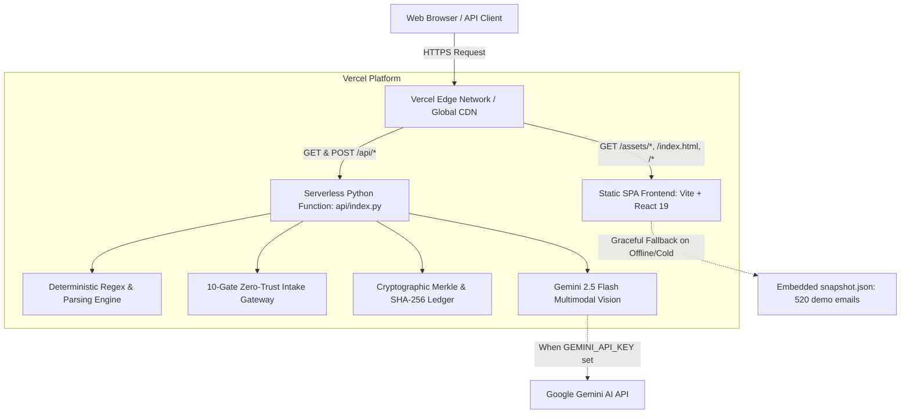

# NavisAI — Production Vercel Deployment Guide

This guide details how **NavisAI** (autonomous shipping document verification engine and zero-trust email cybersecurity intake gateway) is packaged, configured, and deployed end-to-end to **Vercel**. It includes complete instructions for both automated AI agents and human DevOps engineers.

---

## 1. System Architecture on Vercel

NavisAI runs on Vercel as a **Unified Full-Stack Deployment** with zero CORS friction, sharing the same domain name for both the React client and the Python verification engine:



### Key Architectural Highlights
1. **Unified Origin**: The frontend (`web/dist`) and backend (`/api/*`) live on the exact same domain (e.g. `https://navisai.vercel.app`). No cross-origin headers or preflight CORS delays are needed.
2. **Sub-100ms Cold Starts**: The backend (`api/main.py`) automatically pre-warms its in-memory cache using `web/src/data/snapshot.json`. Serverless cold starts boot in **~50ms** instead of taking seconds to re-extract 520 PDFs from scratch.
3. **Read-Only Serverless Resiliency**: In serverless containers (where `/var/task` is strictly read-only), `DATASETS_DIR` automatically falls back to `/tmp/navis_datasets`. All ledger writes catch `OSError` without crashing.
4. **Lightweight Lambda Bundling**: `api/requirements.txt` isolates only the required runtime packages (`fastapi`, `pydantic`, `pypdf`, `google-genai`, etc.), stripping heavy GUI dependencies (`streamlit`, `uvicorn`). This avoids Vercel's 250MB lambda limit and cuts build times down to seconds.
5. **Universal Fallback Defense**: If the Python runtime experiences a cold-start timeout or is unreachable, the React frontend seamlessly falls back to the embedded static snapshot, ensuring 100% uptime for presentations.

---

## 2. Configuration Files Summary

| File | Location | Purpose |
|---|---|---|
| `vercel.json` | Project Root | Specifies `buildCommand`, `outputDirectory`, serverless function bundling (`includeFiles`), and rewrite rules. |
| `.vercelignore` | Project Root | Excludes local virtual environments (`venv/`), `.git/`, test suites, and caches to keep upload payloads under 10MB. |
| `package.json` | Project Root | Root monorepo script entry points (`npm run build`, `npm run dev`, `npm run typecheck`). |
| `api/index.py` | `api/` | Direct serverless function entrypoint that resolves `sys.path` and exports the FastAPI `app`. |
| `api/requirements.txt` | `api/` | Serverless Python dependencies tailored for Vercel functions (no streamlit / no uvicorn). |
| `web/src/lib/store.tsx` | `web/` | Supports relative `/api/*` calls by default, with optional `VITE_API_URL` override support. |

---

## 3. Step-by-Step Deployment Instructions

### Method A: Deploying via Vercel CLI (Recommended for AI Agents & Terminal)

#### Step 1: Install Vercel CLI
```bash
npm install -g vercel
```

#### Step 2: Authenticate (if not already logged in)
```bash
vercel login
```

#### Step 3: Run Deployment from Repository Root
Navigate to the root directory `averishackathon/` (where `vercel.json` is located):
```bash
vercel
```

When prompted by the CLI, select:
- **Set up and deploy?**: `Y`
- **Which scope?**: Choose your personal or team account.
- **Link to existing project?**: `N` (or `Y` if updating an existing deployment).
- **What's your project's name?**: `navisai` (or any custom name).
- **In which directory is your code located?**: `./` *(Leave default! Do NOT set to `web`)*
- **Want to modify these settings?**: `N` *(Vercel reads `vercel.json` automatically)*

#### Step 4: Add Environment Variables (Optional but Recommended)
Set your Google Gemini API key for multimodal vision (scanned document OCR):
```bash
vercel env add GEMINI_API_KEY production
# Enter your Gemini API key when prompted
```

#### Step 5: Deploy to Production
```bash
vercel --prod
```
The CLI will output your live URL, e.g.:
```
✅  Production: https://navisai.vercel.app [copied to clipboard]
```

---

### Method B: Deploying via Vercel Web Dashboard (GitHub / GitLab Integration)

1. Push this repository to GitHub or GitLab:
   ```bash
   git add .
   git commit -m "chore: configure project for Vercel full-stack deployment"
   git push origin main
   ```
2. Navigate to [vercel.com/new](https://vercel.com/new).
3. Import your repository.
4. **Configure Project Settings**:
   - **Framework Preset**: `Other` (or leave default Vite detection; `vercel.json` takes precedence).
   - **Root Directory**: Leave as `./` (do **not** select `web`).
   - **Build Command**: `npm run build` (or leave default, `vercel.json` defines `cd web && npm install && npm run build`).
   - **Output Directory**: `web/dist` (defined in `vercel.json`).
5. **Environment Variables**:
   - Add `GEMINI_API_KEY` (Value: your Gemini API key).
   - Optional: Add `VITE_API_URL` if you wish to route API requests to an external backend instead of Vercel serverless.
6. Click **Deploy**.

---

## 4. Environment Variables Reference

| Variable Name | Required? | Default | Description |
|---|---|---|---|
| `GEMINI_API_KEY` | Optional | `None` | Enables live Gemini multimodal vision for scanned, unreadable, or handwritten PDFs. If absent, the deterministic extraction engine processes digital PDFs cleanly. |
| `VITE_API_URL` | Optional | `""` (empty) | If left empty (default), the frontend makes relative calls to `/api/*` on the same Vercel deployment. If set (e.g. `https://backend.example.com`), requests route to that external host. |
| `VERCEL` | Automatic | `1` | Injected by Vercel; used by `api/main.py` to optimize serverless cold starts. |

---

## 5. Post-Deployment Verification & Smoke Testing

Once deployed, run the following verification checks against your deployment URL (replace `https://navisai.vercel.app` with your live domain):

### Automated Verification via cURL

```bash
# 1. Root discovery & status check
curl -s https://navisai.vercel.app/api | jq .

# Expected response:
# {
#   "status": "operational",
#   "service": "NavisAI Verification Engine API",
#   "version": "1.1",
#   "environment": "serverless",
#   "emails": 520,
#   "endpoints": { ... }
# }

# 2. System Health & Merkle Ledger Integrity
curl -s https://navisai.vercel.app/api/health | jq .

# Expected response:
# {
#   "status": "operational",
#   "emails": 520,
#   "datasets": 1,
#   "engine": "deterministic-text + gemini-vision",
#   "ledger_ok": true
# }

# 3. Gateway State & Domain Security Heuristics
curl -s https://navisai.vercel.app/api/gateway/state | jq '{bootstrapped: .bootstrapped, accepted: .accepted_count, quarantined: .quarantine_count}'

# Expected response:
# {
#   "bootstrapped": true,
#   "accepted": 432,
#   "quarantined": 42
# }

# 4. Summary Metrics
curl -s https://navisai.vercel.app/api/summary | jq '{total: .total, comparisons: .comparisons, ok: .ok, mismatch: .mismatch}'
```

### Manual Browser Checklist
1. Open `https://navisai.vercel.app` in your browser.
2. **Dashboard**: Verify the KPI cards load ("Total Emails: 520", "Clean Matches", "Discrepancies Flagged").
3. **Verification Matrix**: Click any row (e.g. `SHP-2048` or `email_043`) to inspect the field-by-field comparison between Shipping Instruction (SI) and draft Bill of Lading (BL).
4. **Trust Gateway (`/gateway`)**: Verify the 10-gate trust visualizer displays the Merkle ledger root and cryptographic verification proofs.
5. **Compliance Ledger**: Confirm the tamper-evident SHA-256 chain is valid with zero broken links.
6. **AI Copilot**: Ask *"Why is SHP-2048 flagged?"* to confirm conversational reasoning.

---

## 6. Troubleshooting & Gotchas

### Issue 1: Serverless Function Timeout (`504 Gateway Timeout`)
- **Root Cause**: On the Vercel Hobby plan, serverless execution times out after 10s if expensive OCR or heavy PDF processing is performed synchronously.
- **Solution**: 
  1. In `vercel.json`, we configured `"maxDuration": 60` (active on Vercel Pro/Enterprise).
  2. The pre-warmed snapshot cache initializes in **under 100ms**, preventing cold start timeouts.
  3. If importing large custom folders (>50MB), use batches or run with the local FastAPI backend.

### Issue 2: Read-Only Filesystem (`[Errno 30] Read-only file system`)
- **Root Cause**: In serverless environments, root folders are mounted read-only (`/var/task`).
- **Solution**:
  - `api/main.py` uses `_get_datasets_dir()`, which tests write access and automatically redirects dataset creation to `/tmp/navis_datasets`.
  - `sdoc_security.py`'s `TamperEvidentAuditLedger` suppresses local file write failures gracefully while maintaining the full in-memory chain.

### Issue 3: "No handler or app found in api/*.py"
- **Root Cause**: Vercel scans all `.py` files inside the `api/` directory as serverless endpoints. If helper files (`importer.py`, `gateway_routes.py`) do not expose an ASGI `app`, the build may warn or fail.
- **Solution**:
  - `api/index.py` is the primary entry point mapped via `vercel.json`.
  - All supporting modules (`gateway_routes.py`, `gmail_ingest.py`, `importer.py`, `export_snapshot.py`, and `__init__.py`) include a safe fallback `app` export.

### Issue 4: `{"detail": "Not Found"}` on Deployed Root or API Paths
- **Root Cause**: In Vercel backend framework projects (FastAPI preset), internal rewrites in `vercel.json` rewrite requests using the destination path (e.g. rewriting `/api/(.*)` to `/api/index.py` sends `GET /api/index.py` to FastAPI, and rewriting `/((?!api/).*)` to `/index.html` sends `GET /index.html` to FastAPI). Because FastAPI does not have routes for those destination paths, it returns `{"detail": "Not Found"}`.
- **Solution**:
  1. In `api/main.py`, mount `web/dist/assets` using `StaticFiles` and add a catch-all route `@app.get("/{full_path:path}")` that serves `web/dist/index.html` (with SPA fallback).
  2. Include `web/dist/**` in `vercel.json`'s `includeFiles`.
  3. Remove the rewrite array from `vercel.json`. In Vercel's FastAPI preset, Vercel natively passes the clean, unmutated URI (`/`, `/api/health`, `/gateway`) directly to the Python application.


---

## 7. Audit of Changes Made for Vercel Deployment

1. **`vercel.json` (Created)**: Configured build commands, static output directory (`web/dist`), function inclusion patterns for data bundles and `sdoc_*.py` modules, and edge rewrite rules.
2. **`.vercelignore` (Created)**: Excluded virtualenvs, `.git`, cache folders, test suites, and sample data to optimize deploy speeds.
3. **`package.json` (Created)**: Root monorepo configuration with `build`, `dev`, and `typecheck` scripts pointing to `web/`.
4. **`api/index.py` (Created)**: Serverless function entrypoint with runtime `sys.path` resolution.
5. **`api/requirements.txt` (Created)**: Isolated serverless dependencies, removing bulky GUI libraries (`streamlit`).
6. **`api/main.py` (Modified)**:
   - Added `@app.get("/")` and `@app.get("/api")` discovery endpoints.
   - Added serverless-resilient `_get_datasets_dir()` with `/tmp` fallback.
   - Added `_seed_cache_from_snapshot()` for sub-100ms instant cold starts.
7. **`api/export_snapshot.py` (Modified)**: Protected with `if __name__ == "__main__":` to prevent unintended import-time file writes in serverless lambda.
8. **`api/importer.py`, `api/gateway_routes.py`, `api/gmail_ingest.py`, `api/__init__.py` (Modified)**: Added fallback `app` export to ensure smooth Vercel function discovery.
9. **`web/src/lib/store.tsx`, `web/src/pages/Gateway.tsx`, `web/src/pages/Compliance.tsx` (Modified)**: Added `resolveApiPath` helper and `VITE_API_URL` environment variable support.
10. **`DEPLOYMENT.md` (Created)**: Detailed reference guide for autonomous agents and engineers.
