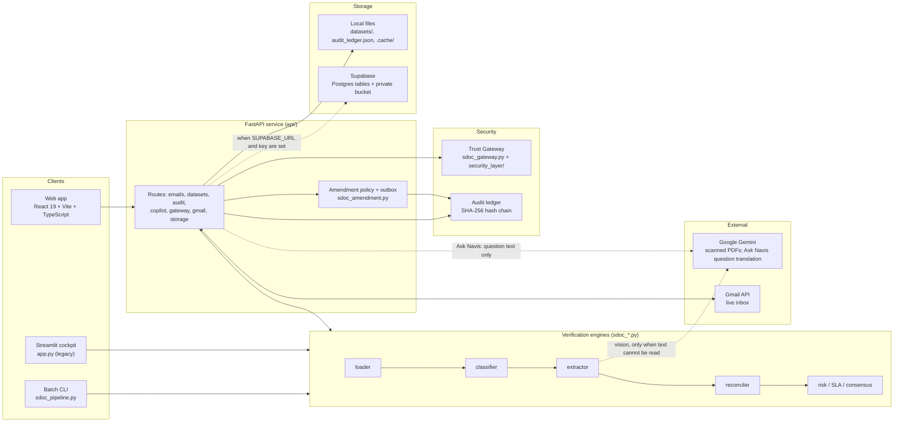
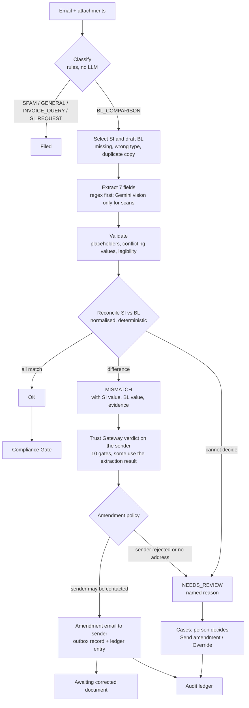
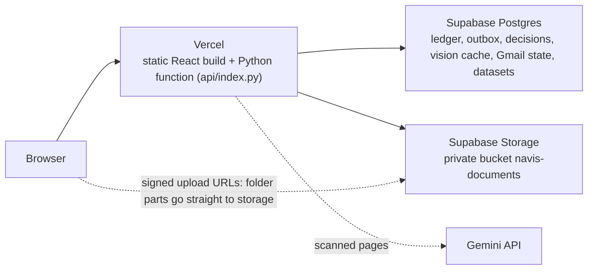

# NavisAI

**AI-assisted shipping-document verification for container-shipping operations.** NavisAI reads a shared operations inbox, finds the Shipping Instruction (SI) and draft Bill of Lading (BL) in each request, extracts seven shipment fields, compares the two, explains every difference with its source lines, asks the sender to fix what is wrong, and sends anything it cannot decide to a person. Every action is written to a tamper-evident audit ledger.

Built for the Averis x Monash Hackathon 2026.

> **Design principle: do not guess.** A missing, unreadable, duplicated or conflicting value is never filled in. The case goes to human review with a named reason.

[Features](#1-features) · [Architecture](#2-system-architecture) · [How it works](#3-how-the-engines-work) · [Results](#4-measured-results) · [Run it](#5-how-to-run-navisai) · [API](#6-api-reference) · [Repo layout](#7-repository-layout) · [Security and limits](#8-security-data-handling-and-limits) · [More docs](#9-further-documentation)

---

## 1. Features

### The problem it solves

Shipping-documentation teams receive mixed emails all day: requests to check an SI against a draft BL, requests for a new SI, invoice questions, operational updates and spam. Checking an SI against a BL by hand is repetitive, and a wrong port, weight or consignee that slips through causes amendments, delays and disputes. NavisAI removes the repetitive checking and keeps people on the exceptions.

### Feature overview

| Area | What it does |
|---|---|
| **Email triage** | Sorts every email into `BL_COMPARISON`, `SI_REQUEST`, `INVOICE_QUERY`, `GENERAL` or `SPAM` with deterministic rules and intent patterns (no model call by default; an optional Gemini fallback for emails no rule matches). |
| **Document identification** | Finds the SI and the draft BL among the attachments by file name and content. Wrong document, missing attachment and a second copy of the BL are detected. |
| **Field extraction** | Reads seven fields from text, PDF, Word and Excel attachments with regular expressions. Scanned PDFs are read with Gemini vision, and only those. |
| **Comparison** | Compares SI against BL on shipper, consignee, notify party, port of loading, port of discharge, container count and gross weight, with normalisation for legal suffixes, port aliases, units and "same as consignee". |
| **Explainability** | Every field keeps its source line number and text snippet; the redline view shows SI value, BL value, the difference and the reason. |
| **Human review** | Anything the system cannot decide is escalated as `NEEDS_REVIEW` with one of four reasons: `missing_attachment`, `wrong_doc_type`, `unreadable`, `missing_value`. |
| **Automatic amendment requests** | A mismatch on any of the seven fields is turned into an amendment email to the original sender and recorded, without a person clicking send. Review cases get a one-click "Send amendment to sender". |
| **Cases workspace** | One page for everything that was flagged: Needs a person, Sent, Awaiting reply, Resolved. |
| **Trust Gateway** | A ten-gate intake pipeline that scores each sender domain, holds a single document mismatch for corroboration, and commits accepted emails to a Merkle-proof ledger. |
| **Audit trail** | A SHA-256 hash-chained ledger of every automatic and human action, with an integrity check. |
| **Compliance Gate** | A pre-release checklist per shipment: document consistency, weight, containers, dangerous-goods markers, HS-code presence and the sender's gateway verdict. |
| **Ask Navis** | Answers questions about one shipment ("Why is SHP-2048 flagged?", then "was it sent?") or the whole inbox ("How many mismatches?", "Which cases need a person?", "What did we send today?", "Which sender has the most errors?"). Every answer is read from the verification results and the amendment log. A question phrased in a way the rules do not recognise is translated by Gemini into one of the supported queries (only the question text is sent, and the reply shows what it was interpreted as); the answer itself is still computed, never generated. A question it cannot answer gets a list of what it can. |
| **Analytics** | Discrepancies by field and carrier, verification volume and auto-resolution rate by batch. |
| **Folder import** | Import a folder of emails and attachments (bundle layout or `.eml` files) as a separate dataset and switch between datasets. |
| **Gmail** | Live inbox listener over OAuth, plus a one-click **Simulate Inbound Gmail** that needs no Google credentials. |
| **Persistence** | With Supabase configured, documents, the ledger, the amendment outbox and decisions survive restarts and redeploys (required on Vercel). Without it, local files are used. |

### The web app

| Page | Purpose |
|---|---|
| **Overview** | KPIs, live pipeline, open items, activity feed. |
| **Inbox Triage** | The classified inbox with filters; select an email to see its documents. |
| **Document Verification** | Animated SI-to-BL run: extraction, side-by-side comparison, redline, evidence, decision. |
| **Cases** | Flagged shipments in four tabs. The drawer shows the amendment email that was sent, the evidence, and the actions (Send amendment to sender, Override result, Corrected document received). |
| **Compliance Gate** | Seven pass/fail checks and a release verdict for one shipment. |
| **Analytics** | Discrepancies by field and by carrier, verification volume and auto-resolution rate by batch. |
| **Audit Trail** | The hash-chained ledger with a verify control. |
| **Trust Gateway** | Sender trust scores, the ten gates, the event log, and Merkle receipts you can verify. |
| **Ask Navis** | The copilot. |
| **Roadmap** | The product roadmap, 2026 to 2030. |
| **Settings** | Workspace information and the system health panel. |

Press **Ctrl+K** for the command palette. If the API is unreachable the demo inbox falls back to an embedded snapshot.

A legacy **Streamlit cockpit** (`app.py`) is also included. The web app is the primary interface.

---

## 2. System architecture

### 2.1 Components



### 2.2 The verification pipeline



### 2.3 Deployment and persistence



A serverless host has no durable disk, so with Supabase configured the local disk is only a cache that is rebuilt from the bucket. Imports upload straight from the browser to the bucket (Vercel rejects request bodies above about 4.5 MB), then the API normalises them.

### 2.4 Where data lives

| Data | Without Supabase | With Supabase |
|---|---|---|
| Imported folders | `datasets/<id>/` | Zip packs in the private bucket, one row in `navis_datasets` |
| Emails added later (Gmail, simulation) | `datasets/gmail_live/` | Objects in the bucket |
| Audit ledger | `audit_ledger.json` | `navis_ledger` (append-only trigger) |
| Amendment outbox | `.cache/amendments.db` (SQLite) | `navis_amendments` |
| Reviewer decisions | In memory | `navis_decisions` |
| Gemini vision reads and call log | `.cache/` | `navis_vision_cache`, `navis_vision_calls` |
| Gmail watcher state | `gmail_state.json` | `navis_kv` |

The Gmail login files (`credentials.json`, `token.json`) are never stored in Supabase. Setup and limits: [SUPABASE_SETUP.md](SUPABASE_SETUP.md).

---

## 3. How the engines work

### 3.1 Classification (`sdoc_classifier.py`)
A decision list, first match wins: SI and BL attached, then a body asking to compare, then a request to send a draft BL, then spam, invoice, SI-request intent, and finally `GENERAL`. Keyword lists are backed by regular-expression intent patterns so unfamiliar wording is still caught. Gateway headers, pasted ticket headers and signatures are ignored. If no rule matches, the rules run again on a cleaned copy of the text: typos in key words (`invocie`, `passwrod`), shorthand (`pls snd shpg instr`), run-together, broken and spaced-out words (`sdoc_textnorm.py`). Nothing is learned. If still no rule matches and a Gemini key is configured, Gemini classifies the email instead of it defaulting to `GENERAL` (`NAVIS_LLM_CLASSIFIER=0` turns this off). Gemini may choose SI request, invoice query, spam or general, but never `BL_COMPARISON`: a document check starts only from attached documents or an explicit request. In the app this runs in the background: the email shows as "Classifying…" until the answer arrives, requests are sent 30 emails at a time, a rate-limited key rests for the delay Gemini asks for, a denied key is dropped, and answers are kept in `.cache/llm_categories.json` (and Supabase) so a dataset is never asked about twice.

### 3.2 Loading and extraction (`sdoc_loader.py`, `sdoc_extractor.py`)
Text, PDF, Word and Excel attachments are parsed and typed by content (a cover sheet or blank sample in front of the document title does not decide the type). Before fields are read, `sdoc_textnorm.py` rewrites unusual layouts as plain `Label: value` lines: carriage-return line endings, HTML exports, fullwidth colons, `=`/tab/CSV separators, horizontal tables, OCR line numbers, checkboxes, markdown, page breaks between a label and its value, and misspelled or OCR-damaged labels (`Consingee`, `P0rt of L0ading`). Only labels are corrected, never values; a misspelled label is used only for a field the document does not state under its proper label, and lines such as `Shipper Contact:` or `Gross Weight Tolerance:` are not read as the field. Fields are found with label-based patterns that accept `Label: value`, dash and pipe forms, numbered dotted lines, and label variants such as `Party to Notify` and `Equipment`. Container counts add up every equipment group (`2 x 20'GP, 3 x 40'HC` is 5). A field stated twice with different values is a conflict. Image-only PDFs go to Gemini vision (default `gemini-3.6-flash`, override with `GEMINI_MODEL`, with fallbacks); every read is cached by the SHA-256 of the file, and each live call logs latency and tokens. If vision fails the document is marked unreadable and escalated. Values read by vision have no line reference; the UI says so instead of showing a line number.

### 3.3 Reconciliation (`sdoc_reconciler.py`)
- Legal suffixes are stripped (`Pte Ltd`, `Sdn Bhd`, `LLC`, `GmbH`, dotted forms).
- Ports match when one side's city words are contained in the other's, so `JEBEL ALI` equals `JEBEL ALI, UAE`, while `Singapore` and `Singapore Changed` differ.
- Other names for the same port are unified first: spelling variants, local names and UN/LOCODEs for about 30 major ports (`PORT KELANG`, `MYPKG` = `PORT KLANG`; `SAIGON` = `HO CHI MINH`; `CHATTOGRAM` = `CHITTAGONG`). Nearby ports and terminals are never merged, so `JEBEL ALI` and `DUBAI` still differ.
- Weights are converted (MT, LBS) and compared with a 0.5 kg tolerance, so a 1 kg difference is reported but rounding noise is not.
- `SAME AS CONSIGNEE` on the notify party is resolved.
- Outcomes: `OK`, `MISMATCH` (with the differing fields), `NEEDS_REVIEW` (`missing_attachment`, `wrong_doc_type`, `unreadable`, `missing_value`).

### 3.4 Amendments (`sdoc_amendment.py`)
A mismatch on any of the seven fields produces an email to the original sender listing each field with its SI and BL value. A sender the Trust Gateway rejected at a security gate, or a missing sender address, is never contacted; a hold or rejection at gate 8, which judges only the mismatch itself, does not block the amendment. Emails that arrive later (simulated or live Gmail) get their amendment straight away. The outbox is keyed by the exact set of differences, so the same amendment is never recorded twice, even across restarts. Review cases get their own wording (missing attachment, wrong document, unreadable file, blank field) through the one-click button in Cases. **Sending is simulated:** an amendment is an outbox record plus a ledger entry, and no email leaves the system.

### 3.5 Trust Gateway (`sdoc_gateway.py`, `security_layer/`)
The gateway looks at the sender and at the verification result of the email (its last gates use the extraction and comparison outcome). Ten sequential gates, cheapest first: domain rate limit, structural parse, sender trust, correspondence check, authentication heuristics, adaptive rate limit, duplicate check, extraction integrity, discrepancy plausibility, commit. Each sender domain has a continuous trust score. A single mismatch is held for corroboration instead of being flagged as fraud. Accepted emails are committed to a Merkle-proof ledger whose receipts can be verified in the UI. Every dataset passes the gateway: the demo inbox at startup, imported folders when they load (as an archive, so without rate limiting), and each new Gmail message as live mail (rate limited). One gateway serves all datasets, so email ids are scoped per dataset.

### 3.6 Other engines
- **Consensus (`sdoc_consensus.py`)**: links emails by booking, BL number and vessel, and tracks draft revisions.
- **Risk (`sdoc_risk.py`)**: estimates demurrage and documentary risk from the defects. Its dollar figures rest on assumed constants and are advisory.
- **SLA (`sdoc_sla.py`)**: extracts vessel cut-offs and ranks the queue by urgency.
- **Security (`sdoc_security.py`)**: heuristic sender checks (blocklisted domains, carrier display-name impersonation; SPF/DKIM/DMARC are not validated), a PDF token scan, financial-data masking, and the hash-chained ledger.

### 3.7 Confidence
Field confidence comes from the extraction path (a fixed high value for text extractions, lower with placeholders). Escalation is decided by structural conditions, not by a confidence threshold. The UI labels the percentage an "extraction score" and marks it as a heuristic, not a calibrated probability. Email classification shows no percentage because the rules do not produce one.

---

## 4. Measured results

| Measure | Result | Source |
|---|---|---|
| Official hackathon self-evaluation | 0.9946 (classification accuracy 0.987, defect precision and recall 1.00, end-to-end 46/46) | official scorer |
| DOCSTRESS set 1 (1,299 emails) | Classification 100%; 260 of 260 SI/BL checks match the expected outcome; 0 false clears, 0 false alarms, 0 unneeded reviews; the differing fields named exactly on 28 of 28 mismatches | `evaluate.py`, `answer key.xlsx` |
| DOCSTRESS set 2 (951 emails) | Classification 100%; 190 of 190 SI/BL checks match; 0 false clears; fields exact on 21 of 21 | `evaluate.py`, `answer key.xlsx` |
| What Gemini vision adds | Offline, 80.8% (set 1) and 81.1% (set 2) of checks go to a person; with vision 71.2% and 71.6%. Vision decides 25 and 18 checks that would otherwise need a person (blurred, rotated, noisy, low-resolution scans), all of them correctly, with 0 false clears either way | `evaluate.py --vision-ablation` |
| Rules vs LLM classifier | On all 2,250 emails, the rules, a zero-shot Gemini classifier (`gemini-3.5-flash-lite`) and a hybrid each score 100%. The LLM costs about 82 tokens per email and about 7 s per batch of 40 emails; the rules cost nothing and take under a millisecond, so Gemini is only a fallback for emails no rule matches | `evaluate.py --llm` |
| Speed, 520-email demo inbox | 0.35 s warm, 4.3 s cold (file reads dominate); no live model calls in the measured run | local benchmark |
| Model use | 6 of 440 SI/BL documents (1.4%) needed Gemini vision | local benchmark |
| Messy-variations holdout (480 emails, 36 families of damage: misspelled and OCR-damaged labels, HTML/CSV/table exports, cover sheets, decoy labels, shorthand and typos in emails) | First run, before any change: 280 of 480 correct, 0 false clears, 0 false alarms (every document it could not read went to review). After the fixes in `sdoc_textnorm.py`, developed on 18 families and then scored on the other 18: 240 of 240 on each half, 480 of 480 overall, rules only. One sample per family was looked at while diagnosing the first run, so the second half is held out from development, not unseen | `test-doc-7/ground_truth.json` |
| Error injection (410 clean SI/BL text pairs from six sets) | One BL field changed at a time (other party, one-letter typo, other port, one more container, weight +2% or +1 kg): 4,507 of 4,507 caught on exactly that field. Harmless edits (capitals, extra spaces): 0 of 2,050 flagged | injection script |
| Gemini as classifier fallback | Asked only about emails no rule matches, 30 per request, in the background. test-doc-3 (3,000 emails, `labels.csv`): classification 86.8% with rules only, 98.2% with the fallback. DOCSTRESS 1 and 2 and the messy-variations set stay at 100%. Official sample: it changes 3 emails, all copies of the reminder "Submit SI & AED" that the key calls GENERAL, so the score is 0.9922 with the fallback and 0.9946 without | answer keys, official scorer |
| Tests | 243 tests pass under pytest (`run_tests.py`), including `security_layer/tests` | test suites |

Both DOCSTRESS sets come from one generator and rules were tuned on the first, so neither is a blind test; the equal LLM score also shows how regular this synthetic data is. The full report, with confusion matrices, results by stress condition and per-field scores, is [EVALUATION.md](EVALUATION.md) (reproduce it with `python evaluate.py`, section 5.8). See also [COMPETITIVE_ADVANTAGE_AUDIT.md](COMPETITIVE_ADVANTAGE_AUDIT.md) and [FEATURE_AUDIT.md](FEATURE_AUDIT.md).

---

## 5. How to run NavisAI

### 5.1 Prerequisites
- Python 3.11 or newer
- Node.js 18 or newer (for the web app)
- Optional: a Google Gemini API key (scanned PDFs), a Supabase project (persistence), Google OAuth credentials (live Gmail)

### 5.2 Install

```bash
git clone https://github.com/Replay0106/averishackathon.git
cd averishackathon

python -m venv venv
# Windows PowerShell:  .\venv\Scripts\Activate.ps1
# macOS / Linux / Git Bash:  source venv/bin/activate    (Git Bash on Windows: source venv/Scripts/activate)
pip install -r requirements.txt

cd web && npm install && cd ..
cp .env.example .env        # Windows PowerShell: copy .env.example .env
```

### 5.3 Configuration (`.env`)

| Variable | Needed for | Notes |
|---|---|---|
| `GEMINI_API_KEY` | Scanned-PDF vision | Optional. Without it, scanned files are escalated as unreadable. `GEMINI_API_KEYS` (comma-separated) and `GEMINI_MODEL` are also read. |
| `SUPABASE_URL`, `SUPABASE_SERVICE_ROLE_KEY` | Persistence | Optional. Server-side only; never commit or expose the service-role key. `SUPABASE_BUCKET` defaults to `navis-documents`. |
| `GMAIL_POLL_INTERVAL_SECONDS`, `GMAIL_LABEL_FILTER` | Live Gmail | Optional. |
| `NAVIS_COPILOT_LLM` | Ask Navis | Optional. Gemini translation of free-form questions is on when a Gemini key is set; `0` turns it off. |
| `NAVIS_LLM_CLASSIFIER` | Classification | Optional. Gemini classifies emails that no rule matches whenever a key is configured; `0` turns this off. |
| `NAVIS_TEXT_MODEL` | Ask Navis, classifier fallback | Optional. Gemini model for text calls; default `gemini-3.5-flash-lite`. |

`credentials.json` and `token.json` (Gmail OAuth) are git-ignored and stay on your machine.

### 5.4 Run the web app (recommended)

Open two terminals in the project root.

```bash
# Terminal 1: API on http://localhost:8000
python -m uvicorn api.main:app --port 8000
```
```bash
# Terminal 2: web app on http://localhost:5173
cd web
npm run dev
```

Open **http://localhost:5173**. The demo inbox (520 emails from `sdoc-hackathon-bundle/`) loads first. Try:
- **Document Verification** to watch an SI-to-BL comparison.
- **Cases** to see automatic amendments and the review cases.
- **Inbox Triage, Simulate Inbound Gmail** to add a clean, mismatching or invoice email.
- **Import folder** (top bar) to load your own folder and switch between datasets.

To serve the built app from the API alone, run `npm --prefix web run build` and open `http://localhost:8000`.

### 5.5 Run the batch pipeline (CLI)

```bash
python sdoc_pipeline.py --bundle sdoc-hackathon-bundle --output submission.json
```
Processes every email and writes a `submission.json` in the hackathon's format.

### 5.6 Run the Streamlit cockpit (legacy)

```bash
streamlit run app.py --server.port 8502
```

### 5.7 Live Gmail (optional)

```bash
# put credentials.json (Google Cloud OAuth desktop client) in the project root
python gmail_watcher.py --poll-once
python gmail_watcher.py --watch --interval 15 --trigger-pipeline
python gmail_watcher.py --simulate --discrepancy --trigger-pipeline   # no Google credentials needed
```
Ready-made demo emails and attachments are in [`sample_demo_emails/`](sample_demo_emails/). Background polling needs a long-running host; it cannot run on Vercel.

### 5.8 Tests

```bash
pip install pytest
python run_tests.py                 # or: python -m pytest tests
python -m unittest discover -s security_layer/tests -t .
cd web && npm run typecheck
```
The test suite never touches a real Supabase project or calls Gemini, even if your keys are in `.env` (set `NAVIS_ALLOW_LIVE_STORE=1` or `NAVIS_ALLOW_LIVE_LLM=1` only if you really want that).

**Evaluate against the answer keys.** `evaluate.py` runs the full pipeline on a labelled folder and scores it against its answer-key spreadsheet; it writes [EVALUATION.md](EVALUATION.md) and `eval_results.json`:

```bash
python evaluate.py --set "DOCSTRESS 1" "../Test doc" "path/to/answer key.xlsx" --set "DOCSTRESS 2" "../Test-doc-2" "../Test-doc-2/answer key.xlsx" --vision-ablation --llm --llm-sample 0
```

`--vision-ablation` also runs each set offline to measure what Gemini vision changes; `--llm` classifies the emails with Gemini as well, to compare rules, LLM and hybrid (answers are cached in `.cache/eval_llm_cache.json`, so a rerun is free); `--price-in`/`--price-out` (USD per million tokens) add a cost line. It never writes to Supabase.

### 5.9 Enable Supabase persistence

1. Create a Supabase project and run `supabase/migrations/20260922000000_navis_persistence.sql` in its SQL editor.
2. Put `SUPABASE_URL` and `SUPABASE_SERVICE_ROLE_KEY` in `.env`.
3. Check the connection: `python -m sdoc_store --selftest`.
4. Restart the API. `GET /api/health` should report `"storage": {"backend": "supabase", ...}`.

### 5.10 Deploy to Vercel

The repository is configured for a single Vercel project: `vercel.json` builds the web app and serves the FastAPI app as a Python function (`api/index.py`, dependencies in `api/requirements.txt`).

```bash
npm i -g vercel
vercel login
vercel --prod
```
Set `SUPABASE_URL`, `SUPABASE_SERVICE_ROLE_KEY` and optionally `GEMINI_API_KEY` as project environment variables first. Without Supabase, the deployment has no durable storage. See [DEPLOYMENT.md](DEPLOYMENT.md) and [SUPABASE_SETUP.md](SUPABASE_SETUP.md).

---

## 6. API reference

| Method and path | Purpose |
|---|---|
| `GET /api/health` | Status, ledger integrity, storage backend |
| `GET /api/emails`, `GET /api/emails/{id}` | Verification results (`?ds=<dataset>` selects a dataset) |
| `GET /api/summary` | Counts by category and outcome |
| `POST /api/emails/{id}/send-amendment` | Reviewer sends an amendment or a request for missing documents |
| `POST /api/emails/{id}/action` | Record a decision (Override, Corrected document received) |
| `GET /api/audit` | Ledger blocks and integrity |
| `GET /api/copilot?q=&ctx=&tz=` | Ask Navis (`ctx`: the shipment the previous answer was about; `tz`: browser offset for "today") |
| `GET /api/datasets`, `GET/DELETE /api/datasets/{id}` | Dataset list, info, delete |
| `POST /api/datasets/import` | Folder import through the API (local mode) |
| `POST /api/datasets/uploads`, `POST /api/datasets/{id}/finalize` | Browser-direct import with Supabase |
| `GET /api/storage/status` | Tells the web app whether direct upload is available |
| `GET /api/gateway/state`, `/ledger`, `/email-check/{id}`, `POST /api/gateway/reset` | Trust Gateway |
| `GET /api/gmail/status`, `POST /api/gmail/simulate`, `/connect`, `/callback`, `/start`, `/stop`, `/poll`, `/disconnect` | Gmail listener and simulation |

Interactive OpenAPI docs are at `http://localhost:8000/docs` when the API runs.

---

## 7. Repository layout

| Path | Contents |
|---|---|
| `sdoc_loader.py`, `sdoc_classifier.py`, `sdoc_extractor.py`, `sdoc_reconciler.py` | The verification engines |
| `sdoc_amendment.py` | Amendment policy, message builder, outbox |
| `sdoc_consensus.py`, `sdoc_risk.py`, `sdoc_sla.py` | Revision lineage, risk estimate, cut-off priority |
| `sdoc_security.py`, `sdoc_gateway.py`, `security_layer/` | Sender heuristics, audit ledger, the ten-gate Trust Gateway |
| `sdoc_store.py`, `supabase/migrations/` | Supabase persistence and the SQL that creates it |
| `sdoc_pipeline.py`, `sdoc_monitor.py`, `gmail_watcher.py` | Batch CLI, folder watcher and rectification notice, Gmail client |
| `api/` | FastAPI service (`main.py`, `importer.py`, `gateway_routes.py`, `gmail_ingest.py`, `index.py` for Vercel) |
| `web/` | React web app (`src/pages`, `src/components`, `src/lib`) |
| `app.py` | Legacy Streamlit cockpit |
| `sdoc-hackathon-bundle/` | The 520-email demo inbox |
| `sample_demo_emails/` | Emails and attachments for live Gmail demos |
| `tests/`, `security_layer/tests/` | Test suites |
| `vercel.json`, `DEPLOYMENT.md` | Vercel configuration and guide |

---

## 8. Security, data handling and limits

- **Standards posture.** NavisAI is designed with reference to ISO/IEC 42001, ISO/IEC 27001, DCSA, the EU AI Act principles and SOC 2 criteria. It holds **no certification or attestation** against any of them and does not implement DCSA eBL. See [STANDARDS_ALIGNMENT.md](STANDARDS_ALIGNMENT.md) for an evidence-based assessment and its gaps.
- **No authentication yet.** The API has no login or roles, CORS is open, and the reviewer name is a fixed default. Do not put real customer data on a public deployment until that is added.
- **Third-party AI.** Scanned pages are sent to the Google Gemini API, and so is the text of an Ask Navis question the rules do not recognise (no shipment data). There is no data-processing agreement, residency decision or retention policy yet. Text documents are processed locally.
- **Simulated sending.** Amendment emails are recorded, not sent.
- **The audit ledger is tamper-evident, not tamper-proof.** It detects edits to earlier entries. Locally it is an unsigned file; on Supabase a trigger blocks updates and deletes. It is not externally anchored or certified.
- **Secrets.** `.env`, `credentials.json` and `token.json` are git-ignored. The Supabase service-role key must stay server-side.
- **Large folders on Vercel.** A function call is limited to 60 seconds, so a folder with thousands of emails may not finish loading in one request. Locally there is no such limit.
- **Confidence and risk figures are heuristics.** The demurrage and exposure numbers use assumed constants.
- **Sender checks are heuristics.** The Trust Gateway starts nine named freight domains at a higher trust score and does not validate SPF, DKIM or DMARC.

---

## 9. Further documentation

| Document | What it covers |
|---|---|
| [SUPABASE_SETUP.md](SUPABASE_SETUP.md) | Persistence: what is stored where, setup, limits |
| [DEPLOYMENT.md](DEPLOYMENT.md) | Vercel deployment |
| [STANDARDS_ALIGNMENT.md](STANDARDS_ALIGNMENT.md) | Alignment with ISO 42001 and 27001, DCSA, EU AI Act, SOC 2 |
| [AVERIS_FIT.md](AVERIS_FIT.md) | Fit with Averis's public priorities and the pitch reasoning |
| [COMPETITIVE_ADVANTAGE_AUDIT.md](COMPETITIVE_ADVANTAGE_AUDIT.md) | Measured strengths and claims to avoid |
| [FEATURE_AUDIT.md](FEATURE_AUDIT.md) | Audit against the hackathon rubric and results history |
| [web/README.md](web/README.md) | Web app notes |

---

**Team NavisAI, Averis Hackathon 2026.**
