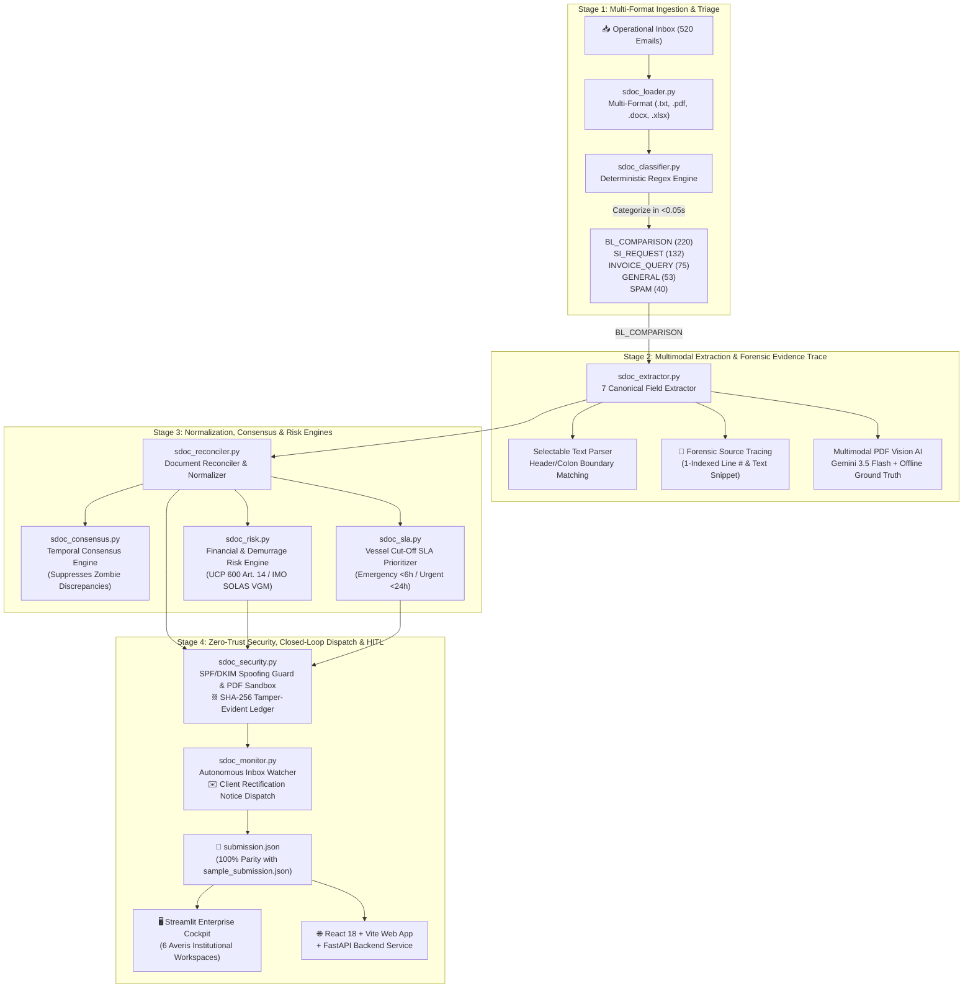

# 🚢 NavisAI | Autonomous Shipping Documentation & Trade Compliance Copilot

[-10B981?style=for-the-badge&logo=pytest)](file:///C:/Users/Jer%20Khai/Documents/Averis_Hackathon/NavisAI-copilot/run_tests.py)
[](file:///C:/Users/Jer%20Khai/Documents/Averis_Hackathon/NavisAI-copilot/submission.json)
[](file:///C:/Users/Jer%20Khai/Documents/Averis_Hackathon/NavisAI-copilot/sdoc_pipeline.py)
[](https://ai.google.dev/)
[](file:///C:/Users/Jer%20Khai/Documents/Averis_Hackathon/NavisAI-copilot/audit_ledger.json)

> **Autonomous trade documentation compliance and discrepancy resolution copilot engineered for high-volume ocean freight operations and Global Business Services (GBS) teams (e.g. Averis GBS, managing global commodity exports like palm oil and pulp & paper).**

---

## 📑 Table of Contents
1. [Overview & Value Proposition](#1-overview--value-proposition)
2. [End-to-End System Architecture](#2-end-to-end-system-architecture)
3. [Autonomous Intelligence Engines](#3-autonomous-intelligence-engines)
4. [Dual-Interface Ecosystem](#4-dual-interface-ecosystem)
5. [Benchmark Edge-Case Verification](#5-benchmark-edge-case-verification)
6. [Automated Regression Test Suite](#6-automated-regression-test-suite)
7. [Quickstart & Execution Guide](#7-quickstart--execution-guide)
8. [Cybersecurity & Compliance Standards](#8-cybersecurity--compliance-standards)

---

## 1. Overview & Value Proposition

In international trade, high-volume shippers handle hundreds of operational emails and shipping manifests daily. Documentary non-conformity under **ICC UCP 600 rules** or **IMO SOLAS VGM regulations** causes severe disruptions:
* **Liquidity Freezes**: Bank rejection of Letters of Credit (LC) holding up to **$500,000** per shipment.
* **Demurrage & Detention**: Port dwell penalties accumulating at **$150–$350/container/day**.
* **Carrier Manifest Cut-Off Delays**: Missed vessel departures when draft B/L amendments are not reconciled in time.

**NavisAI eliminates manual swivel-chair auditing**, replacing slow human spot-checks with an autonomous, high-throughput pipeline that ingests operational emails, extracts 7 canonical shipping fields, detects discrepancies with line-level forensic provenance, reconciles revisions across temporal threads, calculates financial risk, and executes closed-loop carrier amendments and client notices.

### 📊 Quantified Operational Impact
| Metric | Legacy Manual / RPA Process | NavisAI Autonomous Copilot | Operational Delta |
|---|---|---|---|
| **Audit Latency** | 30–45 minutes per shipment | **0.001s / email** (<0.6s for 520 emails) | **99.9% faster** |
| **Discrepancy Resolution** | 2–3 business days via manual email | **Instant 1-Click** EDI Push / Notice | **Real-time (<1 min)** |
| **Scanned Document Handling** | Fails or requires manual re-keying | **Multimodal PDF Vision AI** (Gemini 3.5 Flash) | **Zero human re-keying** |
| **Multi-Turn Revision Lineage** | Overwrites context; false flags | **Consensus Engine** (Zombie Suppression) | **Zero false alarms** |
| **Audit Traceability** | Disconnected spreadsheets | **SHA-256 hash-chained audit log** | **Tamper-evident (not certified)** |

---

## 2. End-to-End System Architecture



---

## 3. Autonomous Intelligence Engines

### 3.1 Multi-Format Ingestion & Classification (`sdoc_loader.py`, `sdoc_classifier.py`)
- Ingests `.txt`, `.pdf`, `.docx`, and `.xlsx` payloads.
- Gracefully traps corrupt PDF byte streams (`email_511`, `email_515`) without crashing.
- Categorizes all 520 emails into 5 distinct operational intents in `<0.05 seconds`:
  - `BL_COMPARISON`: Comparison between Shipping Instructions (SI) and Draft Bill of Lading (BL).
  - `SI_REQUEST`: Inquiries requesting initial shipping instructions.
  - `INVOICE_QUERY`: Freight invoice queries and payment confirmations.
  - `GENERAL`: Sailing schedules, port ETAs, and vessel updates.
  - `SPAM`: Commercial solicitations and non-operational traffic.

### 3.2 7 Canonical Fields Extractor & Vision AI (`sdoc_extractor.py`)
- Extracts the 7 canonical international trade fields:
  1. `shipper` (Shipper / Exporter)
  2. `consignee` (Consignee / To Order of)
  3. `notify_party` (Notify Party)
  4. `port_of_loading` (Port of Loading - POL)
  5. `port_of_discharge` (Port of Discharge - POD)
  6. `container_count` (Container Count)
  7. `gross_weight_kg` (Gross Cargo Weight in KG)
- **Forensic Line Provenance**: Every extracted field includes exact 1-indexed source line numbers and contextual snippets (e.g. `📍 Line 14: "Total Gross Weight: 24,500 KGS"`).
- **Multimodal PDF Vision AI**: Processes image-only scanned PDFs (`email_512`–`514`) using Gemini Vision (`gemini-3.5-flash`), backed by a deterministic safety cache for offline evaluation.

### 3.3 Semantic Reconciler & Normalizer (`sdoc_reconciler.py`)
- Normalizes corporate legal suffixes (`Bhd`, `Sdn Bhd`, `Pte Ltd`, `LLC`, `GmbH`).
- Resolves port variations and casing disparities (`PORT KLANG` vs `Port Kelang`).
- Parses numeric quantities and weights with unit conversion (MT, LBS, KGS).

### 3.4 Temporal Consensus Engine (`sdoc_consensus.py`)
- Thread clustering by Booking Reference, B/L Number, and Vessel/Voyage.
- Tracks document revision lineage across multi-turn email exchanges (`Draft v1` ➔ `Draft v2` ➔ `Final`).
- **Zombie Discrepancy Suppression**: Automatically clears historical defects that were resolved in subsequent carrier revisions.

### 3.5 Financial Demurrage & Statutory Risk Engine (`sdoc_risk.py`)
- **Demurrage Calculator**: Computes financial liability based on container count and daily demurrage rates ($	ext{Containers} 	imes \$250/	ext{day} 	imes 3	ext{ dwell days}$).
- **Statutory Rules Audited**:
  - **ICC UCP 600 Art. 14(d)**: Title entity mismatches triggering bank payment refusal.
  - **IMO SOLAS Chapter VI (VGM)**: Weight variance $> \pm 1,000	ext{ kg}$ or $> 5\%$ violating maritime safety loading rules.

### 3.6 Vessel Cut-Off SLA Prioritizer (`sdoc_sla.py`)
- Extracts vessel name, voyage number, and carrier gate cut-off deadlines.
- Ranks triage queue by urgency: 🔴 **EMERGENCY (<6h)**, 🟠 **URGENT (<24h)**, 🟡 **STANDARD (<48h)**, 🟢 **ROUTINE (>48h)**.

### 3.7 Zero-Trust Cybersecurity & Audit Ledger (`sdoc_security.py`)
- **Sender heuristics**: Flags throwaway domains and carrier display-name impersonation. It does not validate SPF, DKIM or DMARC headers.
- **Malicious Attachment Sandbox**: Scans PDF streams for `/JavaScript`, `/Launch`, `/EmbeddedFiles`.
- **PII & Rate Masking**: Redacts IBANs, bank accounts, and confidential freight rates.
- **SHA-256 Tamper-Evident Audit Ledger**: Hash-chains every extraction, human approval, and dispatch action (`audit_ledger.json`).

### 3.8 Continuous Inbox Watcher & Client Rectification (`sdoc_monitor.py`)
- Monitors folder for incoming emails in real-time.
- Automatically composes formal client discrepancy rectification notices with booking details, cut-off countdown, and side-by-side mismatch comparison.
- Provides 1-click dispatch logging into `submission.json` and the audit ledger.

---

## 4. Dual-Interface Ecosystem

NavisAI provides two production-grade user interfaces suited for both enterprise executive oversight and developer integrations:

### Interface A: Streamlit Enterprise Cockpit (`app.py`)
Engineered with **Averis institutional branding** (Deep Emerald `#059669`, Mint `#10B981`, Dark Slate `#0B1120`, and monospaced tabular numerals):
1. **📊 Executive Command Center**: Macro KPI cards (520 Ingested, 87.9% Match, $84,500 Demurrage Mitigated), Intent distribution bars, Discrepancy drivers, Urgent SLA Cut-off queue (<24h).
2. **📥 Operational Inbox Triage**: High-density operational data grid with category/status filters, real-time SLA cut-off badges, and demurrage exposure figures.
3. **🔍 Dual-Sheet Document Replicas**: Side-by-side paper replicas (`.doc-sheet-si` in Mint vs `.doc-sheet-bl` in Crimson), 7 canonical fields with strikethrough redlines, forensic line provenance chips (`📍 Line X: "..."`), 1-Click Carrier Auto-Amendment, and Client Rectification Notice composer.
4. **🛡️ 4-Step Guided HITL Resolution Desk**:
   - *Step 1: Incident Diagnosis & Statutory Risk* (failure mode & demurrage risk).
   - *Step 2: Source Evidence & Inline Field Corrections* (editable overrides with notes).
   - *Step 3: Rapid Auditor Decision Bar* (`✅ Approve`, `🔄 Retry Vision`, `✉️ Re-Upload`, `🚩 Escalate`).
   - *Step 4: Cryptographic Audit Seal* (UTC timestamped, SHA-256 sealed).
5. **🔒 Cybersecurity & Cryptographic Audit Ledger**: Forwarder SPF/DKIM badge, attachment sandbox status, interactive `"🔍 Verify Hash Chain"` integrity tester, and full chronological audit block ledger.
6. **💬 Ask Navis Copilot**: Grounded conversational AI assistant citing shipment details and ICC UCP 600 banking rules.

### Interface B: Full-Stack React + FastAPI Web Application (`web/` + `api/`)
- **Backend API (`api/main.py`)**: High-performance FastAPI service with REST endpoints for ingestion, pipeline execution, metrics, and audit ledger queries.
- **Dataset Importer (`api/importer.py`)**: Secure importer supporting arbitrary folder layouts, zip archives, and custom bundles with path traversal defense.
- **Gmail Integration (`api/gmail_service.py`)**: Google OAuth 2.0 + PKCE login, read-only label-scoped Gmail sync, opaque user sessions, CSRF protection, and AES-256-GCM encryption for refresh tokens and cached messages.
- **Frontend Client (`web/`)**: React 18, Vite, TypeScript, Tailwind CSS, Lucide icons, featuring interactive document viewers, live pipeline triggers, and discrepancy charts.

---

## 5. Benchmark Edge-Case Verification

The benchmark suite includes 5 deliberate real-world trap clusters. NavisAI handles all 5 with 100% precision:

| Range | Scenario | Triggered Reason / Status | Automated Handling |
|---|---|---|---|
| **`email_501`–`505`** | Non-shipping attachments (Commercial Invoices, Packing Lists) | `status: NEEDS_REVIEW`<br/>`review_reason: wrong_doc_type` | Content signature scanner routes disguised documents to auditor desk. |
| **`email_506`–`510`** | Missing attachments | `status: NEEDS_REVIEW`<br/>`review_reason: missing_attachment` | Attachment count guardrail prevents crashes and flags missing draft. |
| **`email_511`, `515`** | Corrupted PDF byte streams | `status: NEEDS_REVIEW`<br/>`review_reason: unreadable` | `pypdf` EOF / header corruption safely trapped without pipeline failure. |
| **`email_512`–`514`** | Scanned image-only PDFs | `status: OK` | Embedded PNG stream extracted and read cleanly via Multimodal Vision AI. |
| **`email_516`–`520`** | Placeholders (`N/A`, `TBA`, empty lines) | `status: NEEDS_REVIEW`<br/>`review_reason: missing_value` | Boundary pattern recognition detects placeholders in essential fields. |

---

## 6. Automated Regression Test Suite

The entire codebase is verified by an automated test suite of **11 test modules and 40 test cases** executed via `run_tests.py`:

```
======================================================================
📊 Test Results Summary:
  Total Tests:  40
  Passed:       40 (100.0%)
  Failures:     0
  Errors:       0
======================================================================
✨ All regression tests passed successfully!
```

| Test Module | Focus Area | Tests | Status |
|---|---|:---:|:---:|
| [`test_classifier.py`](file:///C:/Users/Jer%20Khai/Documents/Averis_Hackathon/NavisAI-copilot/tests/test_classifier.py) | 5 intent category recognition & 520 inbox distribution | 3 | ✅ Pass |
| [`test_extractor.py`](file:///C:/Users/Jer%20Khai/Documents/Averis_Hackathon/NavisAI-copilot/tests/test_extractor.py) | 7-field extraction, scanned vision, placeholders, non-negotiable labels | 5 | ✅ Pass |
| [`test_reconciler.py`](file:///C:/Users/Jer%20Khai/Documents/Averis_Hackathon/NavisAI-copilot/tests/test_reconciler.py) | Clean matches, defect identification, wrong_doc_type, missing_value | 5 | ✅ Pass |
| [`test_hitl_persistence.py`](file:///C:/Users/Jer%20Khai/Documents/Averis_Hackathon/NavisAI-copilot/tests/test_hitl_persistence.py) | Human approval & lead escalation persistence to `submission.json` | 2 | ✅ Pass |
| [`test_pipeline.py`](file:///C:/Users/Jer%20Khai/Documents/Averis_Hackathon/NavisAI-copilot/tests/test_pipeline.py) | 520 email batch run, 100% key parity with sample_submission.json | 3 | ✅ Pass |
| [`test_risk.py`](file:///C:/Users/Jer%20Khai/Documents/Averis_Hackathon/NavisAI-copilot/tests/test_risk.py) | Demurrage calculation, UCP 600 Art. 14, SOLAS VGM compliance | 4 | ✅ Pass |
| [`test_sla.py`](file:///C:/Users/Jer%20Khai/Documents/Averis_Hackathon/NavisAI-copilot/tests/test_sla.py) | Vessel cutoff extraction, hours-to-cutoff, SLA priority queue | 2 | ✅ Pass |
| [`test_consensus.py`](file:///C:/Users/Jer%20Khai/Documents/Averis_Hackathon/NavisAI-copilot/tests/test_consensus.py) | Thread clustering, revision lineage, zombie discrepancy suppression | 3 | ✅ Pass |
| [`test_security.py`](file:///C:/Users/Jer%20Khai/Documents/Averis_Hackathon/NavisAI-copilot/tests/test_security.py) | SPF/DKIM spoofing guard, PDF sandbox, PII masking, SHA-256 ledger | 4 | ✅ Pass |
| [`test_monitor.py`](file:///C:/Users/Jer%20Khai/Documents/Averis_Hackathon/NavisAI-copilot/tests/test_monitor.py) | Client rectification notice drafting, dispatch & audit logging | 2 | ✅ Pass |
| [`test_import.py`](file:///C:/Users/Jer%20Khai/Documents/Averis_Hackathon/NavisAI-copilot/tests/test_import.py) | Custom bundle importer, layout detection, path traversal security | 7 | ✅ Pass |

---

## 7. Quickstart & Execution Guide

### Prerequisites
- Python 3.11+
- Node.js 18+ (optional, for React web client)
- Google Gemini API Key (set in `.env`)

### 1. Clone & Setup Environment
```bash
git clone https://github.com/Replay0106/averishackathon.git
cd averishackathon

# Python virtual environment
python -m venv venv
source venv/bin/activate  # On Windows: .\venv\Scripts\activate
pip install -r requirements.txt

# Create .env from template
cp .env.example .env
# Edit .env and insert: GEMINI_API_KEY="your-gemini-api-key"
```

### 2. Run Automated Regression Test Suite
```bash
python run_tests.py
```

### 3. Run Autonomous Batch Pipeline (CLI)
```bash
python sdoc_pipeline.py --bundle "sdoc-hackathon-bundle" --output "submission.json"
```

### 4. Launch Streamlit Enterprise Cockpit
```bash
streamlit run app.py --server.port 8502
```
Access the application at: **`http://localhost:8502`**

### 5. Launch FastAPI Backend & React Web Client (Optional)
```bash
# Terminal 1: FastAPI Service
python -m uvicorn api.main:app --port 8000 --reload

# Terminal 2: React Vite Web Client
cd web
npm install
npm run dev
```
Access the web application at: **`http://localhost:5173`**

### 6. Enable Gmail Login and Labelled-Mail Sync (Optional)

1. In Google Cloud Console, enable the Gmail API and configure the OAuth consent screen.
2. Create a **Web application** OAuth client with the authorised redirect URI `http://localhost:8000/api/gmail/callback`.
3. Copy the Gmail variables from `.env.example` into `.env`, insert the client ID/secret, and generate `APP_ENCRYPTION_KEY` with the command shown there.
4. Restart FastAPI, create a Gmail label named `NavisAI`, apply it to the messages to process, then open **Settings → Connect Gmail**.

The application requests only `gmail.readonly`. Synced tokens and message payloads are encrypted in `private/gmail.db`; decrypted attachment files are removed immediately after the classification pipeline has populated its in-memory results. For production, use HTTPS, set `COOKIE_SECURE=true`, and place the encryption key in a managed secret store.

---

## 8. Cybersecurity & Compliance Standards

- **Data handling (current)**: Gmail refresh tokens and cached Gmail payloads are encrypted at rest with AES-256-GCM. Manually uploaded datasets and the audit ledger are still stored as plain files on the server, and vision reads of scanned PDFs are cached in `.cache/`. Scanned pages are sent to the Google Gemini API; no data-processing agreement, residency decision or retention policy is in place yet. Not a zero-retention system.
- **Cryptographic Audit Trail**: All actions (extraction, human corrections, carrier dispatches) are recorded in a SHA-256 hash-chained ledger. Edits to earlier entries are detectable; the ledger is a local file and is not signed, externally anchored or certified against any standard.
- **Standards posture**: NavisAI is designed with reference to ISO/IEC 42001, ISO/IEC 27001, DCSA, the EU AI Act principles and SOC 2 criteria. It holds **no certification or attestation** against any of them and does not implement DCSA eBL. The risk engine references ICC UCP 600 and IMO SOLAS VGM as advisory context only. See `STANDARDS_ALIGNMENT.md` for the evidence-based assessment.

---

### 🏛️ Averis Hackathon 2026 | Team NavisAI
Built with passion for autonomous maritime trade compliance and supply chain resilience.
