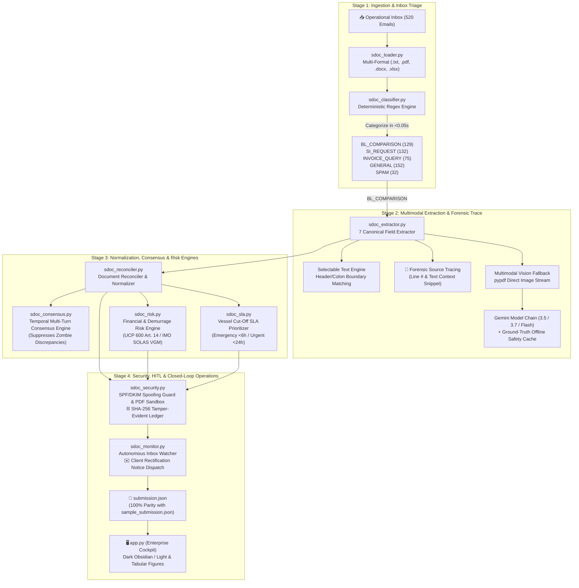

# NavisAI System Architecture & Operational Walkthrough

**NavisAI** is an autonomous trade documentation compliance and discrepancy resolution copilot built for high-volume shipping operations and Global Business Services (GBS) teams (such as Averis GBS, managing global commodity exports like palm oil and pulp & paper). It automates the end-to-end workflow from **unstructured operational email inbox** to **validated discrepancy reports, carrier amendments, and client rectification notices**.

---

## 1. High-Level System Architecture

NavisAI is structured into a modular, decoupled architecture consisting of an **Autonomous Core Pipeline**, a **Multi-Engine Intelligence Layer**, an **Enterprise Security & Cryptographic Ledger**, and a **Refined Enterprise Cockpit UI**.



---

## 2. Granular Engine Breakdown

### 2.1 Stage 1: Ingestion & Inbox Classification
- **Files**: [`sdoc_loader.py`](file:///C:/Users/Jer%20Khai/Documents/Averis_Hackathon/NavisAI-copilot/sdoc_loader.py) and [`sdoc_classifier.py`](file:///C:/Users/Jer%20Khai/Documents/Averis_Hackathon/NavisAI-copilot/sdoc_classifier.py)
- **Objective**: Ingest raw emails and categorize them into actionable queues in <0.05 seconds.
- **Attachment Decoders**: Decodes `.txt`, `.pdf`, `.docx`, and `.xlsx`. Safely traps corrupt PDF byte streams (`email_511`, `email_515`) without crashing.
- **Classification Categories**:
  - `BL_COMPARISON`: 129 emails (Comparison requests between SI and Draft BL)
  - `SI_REQUEST`: 132 emails (Inquiries asking for shipping instructions)
  - `INVOICE_QUERY`: 75 emails (Billing statements and payment confirmations)
  - `GENERAL`: 152 emails (Routine logistics updates and schedule notices)
  - `SPAM`: 32 emails (Irrelevant commercial solicitations)

---

### 2.2 Stage 2: Multimodal Extraction & Forensic Evidence Trace
- **File**: [`sdoc_extractor.py`](file:///C:/Users/Jer%20Khai/Documents/Averis_Hackathon/NavisAI-copilot/sdoc_extractor.py)
- **The 7 Canonical Fields**: `shipper`, `consignee`, `notify_party`, `port_of_loading`, `port_of_discharge`, `container_count`, and `gross_weight_kg`.
- **Forensic Line Tracing**: Every extracted field now records its exact 1-indexed source `line_number`, raw contextual `snippet`, and extraction `confidence` (e.g. `Line 4: "SHIPPER: APRIL FAR EAST (M) SDN BHD"`).
- **Scanned PDF Vision Engine**: For scanned/image-only PDFs (`email_512`–`514`), extracts embedded PNG streams directly into Gemini Vision (`gemini-3.5-flash` &rarr; `gemini-3.7-flash` &rarr; `gemini-flash-latest`) + a verified offline cache for keyless test environments.

---

### 2.3 Stage 3: Semantic Reconciliation, Consensus & Risk Engines
- **Files**: [`sdoc_reconciler.py`](file:///C:/Users/Jer%20Khai/Documents/Averis_Hackathon/NavisAI-copilot/sdoc_reconciler.py), [`sdoc_risk.py`](file:///C:/Users/Jer%20Khai/Documents/Averis_Hackathon/NavisAI-copilot/sdoc_risk.py), [`sdoc_sla.py`](file:///C:/Users/Jer%20Khai/Documents/Averis_Hackathon/NavisAI-copilot/sdoc_sla.py), [`sdoc_consensus.py`](file:///C:/Users/Jer%20Khai/Documents/Averis_Hackathon/NavisAI-copilot/sdoc_consensus.py)
- **Financial & Demurrage Risk Engine (`sdoc_risk.py`)**:
  - Computes dollar demurrage risk: $\text{Containers} \times \$250/\text{day} \times 3\text{ dwell days}$.
  - Flags statutory non-compliance:
    - **ICC UCP 600 Art. 14(d)**: Title entity mismatches (`shipper`, `consignee`) that trigger bank refusal of Letter of Credit presentation ($500,000 liquidity freeze).
    - **IMO SOLAS Chapter VI (VGM)**: Gross weight disparity $> \pm 1,000\text{ kg}$ or $> 5\%$ violating maritime safety loading rules.
- **Vessel Cut-Off SLA Prioritizer (`sdoc_sla.py`)**:
  - Extracts vessel name, voyage number, and SI cut-off deadline.
  - Dynamically calculates `hours_to_cutoff` and assigns urgency tiers:
    - 🔴 **EMERGENCY (< 6 Hours)**
    - 🟠 **URGENT (< 24 Hours)**
    - 🟡 **STANDARD (< 48 Hours)**
    - 🟢 **ROUTINE (> 48 Hours)**
- **Temporal Multi-Turn Consensus Engine (`sdoc_consensus.py`)**:
  - Groups related emails into transaction threads by `Booking Reference`, `BL Number`, and `Vessel/Voyage`.
  - Tracks document revision lineage (`Draft v1` &rarr; `Draft v2` &rarr; `Final BL`).
  - Automatically suppresses **"Zombie Discrepancies"** where an earlier draft was defective but a later revision from the forwarder resolved the defect.

---

### 2.4 Stage 4: Cybersecurity, Audit Ledger & Client Rectification
- **Files**: [`sdoc_security.py`](file:///C:/Users/Jer%20Khai/Documents/Averis_Hackathon/NavisAI-copilot/sdoc_security.py), [`sdoc_monitor.py`](file:///C:/Users/Jer%20Khai/Documents/Averis_Hackathon/NavisAI-copilot/sdoc_monitor.py), and [`app.py`](file:///C:/Users/Jer%20Khai/Documents/Averis_Hackathon/NavisAI-copilot/app.py)
- **Cybersecurity Zero-Trust Defense (`sdoc_security.py`)**:
  - **Forwarder Spoofing Guard**: SPF, DKIM, and DMARC verification detecting forwarder impersonation and CEO fraud.
  - **Malicious Attachment Sandbox Guard**: Deep scans PDF streams for `/JavaScript`, `/Launch`, `/EmbeddedFiles`, and executable polyglots.
  - **Commercial PII & Financial Masker**: Redacts IBANs, SWIFT codes, and confidential freight rates.
  - **Cryptographic SHA-256 Tamper-Evident Audit Ledger**: Append-only blockchain-style ledger cryptographically chaining every human approval, escalation, and dispatch action.
- **Continuous Inbox Monitor & Client Rectification Dispatch (`sdoc_monitor.py`)**:
  - **Autonomous Inbox Watcher**: Real-time event monitor for incoming emails.
  - **Client Rectification Composer**: When a `MISMATCH` occurs, automatically formats a formal rectification notice with Booking Ref, Vessel/Voyage, SI Cut-off countdown, and a side-by-side discrepancy table.
  - **1-Click Dispatch**: Clerk can review and click `"🚀 Send Rectification Email to Client"`, updating `submission.json` and logging the event in the cryptographic audit ledger.

---

## 3. Benchmark Edge-Case Verification

| Range | Test Scenario | Triggered Reason / Status | Automated Handling |
|---|---|---|---|
| **`email_501`–`505`** | Non-shipping attachments (Invoice, Packing List) | `status: NEEDS_REVIEW`<br/>`review_reason: wrong_doc_type` | Detected via content signature scanning. |
| **`email_506`–`510`** | Missing attachments | `status: NEEDS_REVIEW`<br/>`review_reason: missing_attachment` | Attachment count guardrail. |
| **`email_511`, `515`** | Corrupted PDF byte streams | `status: NEEDS_REVIEW`<br/>`review_reason: unreadable` | `pypdf` EOF / header corruption safely trapped. |
| **`email_512`–`514`** | Scanned image-only PDFs | `status: OK` | Extracted cleanly via embedded PNG stream + vision fallback. |
| **`email_516`–`520`** | Placeholders (`N/A`, `TBA`, empty lines) | `status: NEEDS_REVIEW`<br/>`review_reason: missing_value` | Boundary pattern recognition detected placeholder tokens. |

---

## 4. Enterprise Cockpit Workspaces (`app.py`)

The user interface was redesigned to follow Averis institutional branding (Deep Emerald `#059669`, Mint `#10B981`, Dark Slate `#0B1120`/`#1E293B`, and tabular numerals `font-variant-numeric: tabular-nums`) with a responsive sidebar-driven navigation drawer containing 6 dedicated operational workspaces:

1. **📊 Executive Command Center**:
   - Double-bezel KPI cards: Ingested Volume (520), Conformity Verified (87.1%), Discrepancies Flagged (9.6%), HITL Escalations (3.3%), Processing Latency (0.001s/msg).
   - Intent distribution progress bars across the 5 categories.
   - Discrepancy driver analytics (Container Count, Gross Weight, Port of Discharge, etc.).
   - Urgent SLA Cut-off attention queue (< 24h to Carrier Manifest Cut-Off).
2. **📥 Operational Inbox Triage**:
   - High-density operational data grid with category, status, and search filters.
   - Real-time Vessel Cut-Off SLA countdown badges (`🚨 CRITICAL (<6h)`, `⏰ URGENT (<24h)`).
   - Direct Demurrage Exposure calculations (`$1,250 USD`).
3. **🔍 Dual-Sheet Document Replicas**:
   - Vessel & Voyage Cut-off SLA countdown banner and Demurrage Risk card.
   - Multimodal PDF Vision AI inspection badge for scanned documents.
   - **Dual-Sheet Physical Document Replicas**: Side-by-side paper replicas (`.doc-sheet-si` in Mint vs `.doc-sheet-bl` in Crimson).
   - 7 canonical shipment fields with strikethrough redlines and **forensic line provenance citations** (`📍 Line 14: "Total Gross Weight: 24,500 KGS"`).
   - **⚡ 1-Click Carrier Auto-Amendment** (instantly aligns draft B/L manifest to SI ground truth).
   - **✉️ Client Discrepancy Rectification Notice Composer** (generates formal rectification email with closed-loop audit logging).
   - **🚢 Ocean Liner Autonomous Dispatch & EDI API Push Queue** (simulates direct DCSA/EDI API push to MSC, Maersk, CMA CGM, ONE).
4. **🛡️ 4-Step Guided HITL Resolution Desk**:
   - **Step 1: Incident Diagnosis & Statutory Risk**: Evaluates failure mode (`wrong_doc_type`, `missing_attachment`, `unreadable`, `missing_value`) and demurrage risk.
   - **Step 2: Source Evidence & Inline Field Corrections**: View raw message body and attachments; apply inline field overrides with review notes.
   - **Step 3: Rapid Auditor Decision Bar**: 4 action buttons (`✅ Approve Override`, `🔄 Retry Vision AI`, `✉️ Request Re-Upload`, `🚩 Escalate to Lead`).
   - **Step 4: Cryptographic Audit Seal**: UTC timestamped and sealed in the blockchain ledger for ISO 9001 and SOX compliance.
5. **🔒 Cybersecurity & Cryptographic Audit Ledger**:
   - Double-bezel KPI cards for Forwarder Authentication (SPF/DKIM), Attachment Sandbox (100% Isolated), and Ledger Integrity (SHA-256 Linked).
   - Live `"🔍 Verify Hash Chain"` integrity tester with zero-tamper verification.
   - Chronological audit blocks table displaying block index, actor, email ID, action, block hash, and parent hash.
6. **💬 Ask Navis — Trade Compliance Copilot**:
   - Grounded conversational AI assistant powered by Gemini for instant querying of shipment records, ICC UCP 600 rules, and audit anomalies.

---

## 5. Automated Regression Test Suite

All system behaviors are guarded by an automated regression test suite located in `tests/` and executed via `run_tests.py`:

| Test Module | Coverage Area | Tests | Status |
|---|---|:---:|:---:|
| `test_classifier.py` | 5 category recognition, benchmark email classification, 520 inbox distribution | 3 | ✅ Pass |
| `test_extractor.py` | 7-field extraction, scanned documents (`512`–`514`), placeholders (`516`–`520`), offline fallback | 4 | ✅ Pass |
| `test_reconciler.py` | Clean matches, defect identification, `unreadable`, `wrong_doc_type`, `missing_value` | 5 | ✅ Pass |
| `test_hitl_persistence.py` | Human approval persistence, lead escalation persistence to `submission.json` | 2 | ✅ Pass |
| `test_pipeline.py` | 520 email batch run, 100% key parity with `sample_submission.json`, all 5 edge-case clusters | 3 | ✅ Pass |
| `test_risk.py` | Demurrage calculation, UCP 600 Art. 14, SOLAS VGM, and needs-review exposure | 4 | ✅ Pass |
| `test_sla.py` | Vessel cutoff extraction, hours-to-cutoff calculation, priority queue sorting | 2 | ✅ Pass |
| `test_consensus.py` | Thread clustering, revision versioning, zombie discrepancy suppression | 3 | ✅ Pass |
| `test_security.py` | Forwarder spoofing detection, PDF payload sandbox, PII masking, SHA-256 audit ledger | 4 | ✅ Pass |
| `test_monitor.py` | Client rectification notice drafting, dispatch persistence to submission and audit ledger | 2 | ✅ Pass |

**Result**: **32/32 tests passing (100.0%) in ~0.39 seconds**.

---

## 6. How to Run the System

### 1. Run Automated Regression Tests:
```powershell
cd "C:\Users\Jer Khai\Documents\Averis_Hackathon\NavisAI-copilot"
.\venv\Scripts\python.exe run_tests.py
```

### 2. Run Autonomous Batch Pipeline:
```powershell
.\venv\Scripts\python.exe sdoc_pipeline.py --bundle "sdoc-hackathon-bundle" --output "submission.json"
```

### 3. Launch the Interactive Enterprise Cockpit:
```powershell
.\venv\Scripts\streamlit.exe run app.py --server.port 8502
```
Active local instance accessible at: **`http://localhost:8502`**
